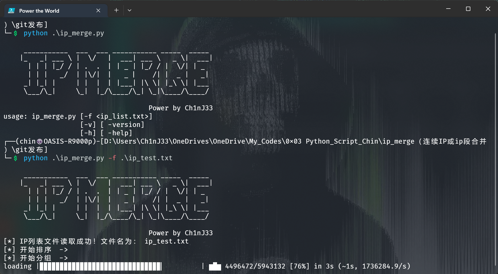
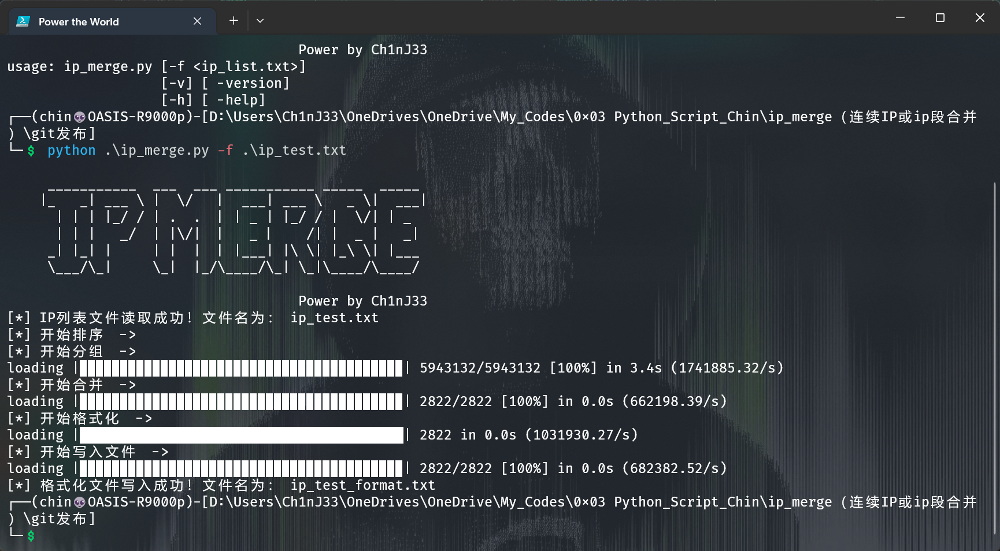

# IP区间合并工具，合并连续单个IP或者重叠交集IP段

### Author：Ch1nJ33

https://github.com/ch1nj33

## 环境：[python3]

### 用途：为整合规律ip，减少防火墙中规则条数。将连续i单个ip或重叠交集ip段，整理为 `192.168.1-3-192.168.1.56` 或  `10.1.1.0/24`


### install

```shell
pip install ./install_files/about-time-4.2.1.tar.gz
pip install ./install_files/grapheme-0.6.0.tar.gz
pip install ./install_files/alive_progress-3.1.4-py3-none-any.whl
```


### **usage** :

```shell
python ip_merge.py [-f <ip_list.txt>]
```


### 运行截图




